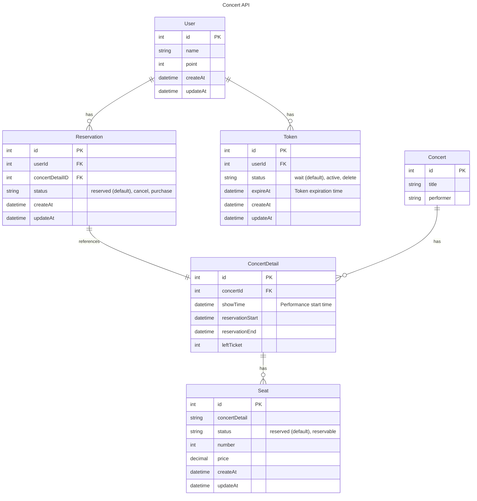

```mermaid
---
title: Concert API
---
erDiagram
    User {
        int id PK
        string name
        int point
        datetime createAt
        datetime updateAt
    }
    Seat {
        int id PK
        string concertDetail
        string status "reserved (default), reservable"
        int number
        decimal price
        datetime createAt
        datetime updateAt
    }
    Reservation {
        int id PK
        int userId FK
        int concertDetailID FK
        string status "reserved (default), cancel, purchase"
        datetime createAt
        datetime updateAt
    }
    Token {
        int id PK
        int userId FK
        string status "wait (default), active, delete"
        datetime expireAt "Token expiration time"
        datetime createAt
        datetime updateAt
    }

    Concert {
        int id PK
        string title
        string performer        
    }

    ConcertDetail {
        int id PK
        int concertId FK
        datetime showTime "Performance start time"
        datetime reservationStart
        datetime reservationEnd
        int leftTicket
    }

    User ||--o{ Reservation : "has"
    User ||--o{ Token            : "has"
    Reservation ||--|| ConcertDetail : "references"
    Concert ||--o{ ConcertDetail : "has"
    ConcertDetail ||--o{ Seat : "has"
        
```