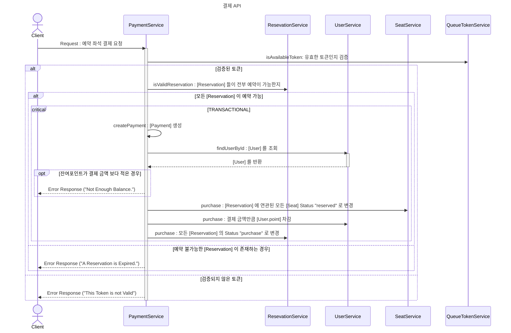

```mermaid
---
title: 결제 API  
---
sequenceDiagram
    Actor cl as Client
    participant pa as PaymentService
    participant re as ResevationService
    participant us as UserService 
    participant se as SeatService
    participant qu as QueueTokenService


    cl->>pa : Request : 예약 좌석 결제 요청 
    activate pa
    
    pa->>qu : isAvailableToken: 유효한 토큰인지 검증  

    alt 검증된 토큰 
            pa->>re: isValidReservation : [Reservation] 들이 전부 예약이 가능한지 
            
            alt 모든 [Reservation] 이 예약 가능 
                critical TRANSACTIONAL 
                    pa->>pa : createPayment : [Payment] 생성

                    pa->>us  : findUserById : [User] 를 조회
                    activate us 
                    us-->>pa : [User] 를 반환 
                    deactivate us 


                    opt 잔여포인트가 결제 금액 보다 적은 경우 
                        pa-->>cl : Error Response ("Not Enough Balance.")
                    end 

                    pa->>se  : purchase  : [Reservation] 에 연관된 모든 [Seat] Status "reserved" 로 변경 
                    pa->>us  : purchase  : 결제 금액만큼 [User.point] 차감 
                    pa->>re  : purchase  : 모든 [Reservation] 의 Status "purchase" 로 변경
                    


                end 

            else 예약 불가능한 [Reservation] 이 존재하는 경우 
                pa-->>cl: Error Response ("A Reservation is Expired.")
            end

    
    else 검증되지 않은 토큰
        pa-->>cl : Error Response ("This Token is not Valid")
    end

    deactivate pa


                   
```