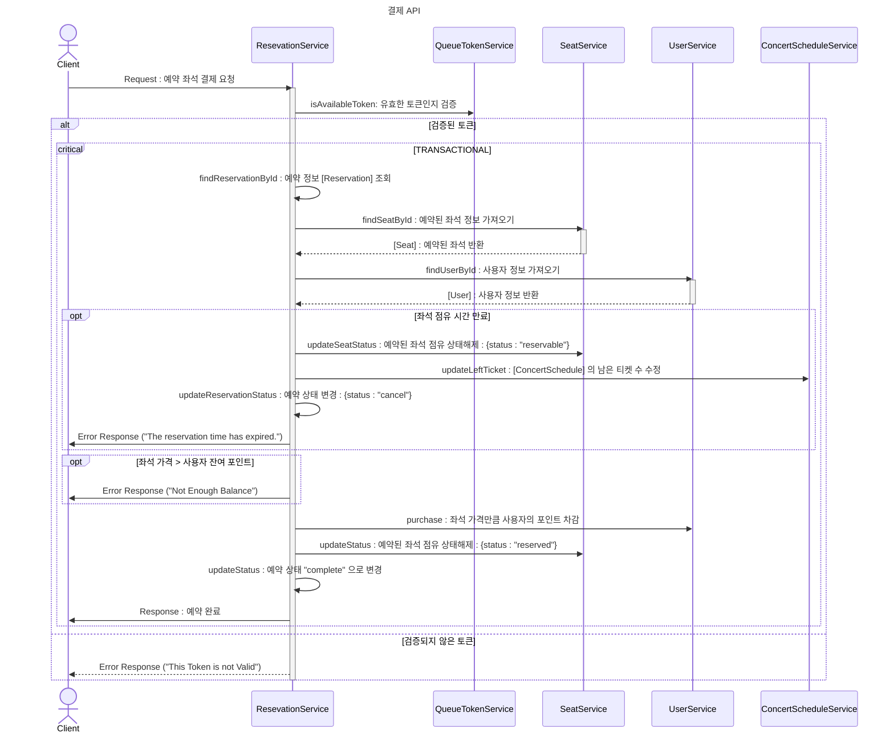

```mermaid
---
title: 결제 API  
---
sequenceDiagram
    Actor cl as Client
    participant re as ResevationService
    participant qu as QueueTokenService
    participant se as SeatService 
    participant us as UserService 
    participant cs as ConcertScheduleService

    
    cl->>re : Request : 예약 좌석 결제 요청 
    activate re
    
    re->>qu : isAvailableToken: 유효한 토큰인지 검증  

    alt 검증된 토큰 
        critical TRANSACTIONAL
            re->> re  : findReservationById : 예약 정보 [Reservation] 조회

            re->> se  : findSeatById  : 예약된 좌석 정보 가져오기
            activate se

            se-->> re : [Seat] : 예약된 좌석 반환 
            deactivate se

            re->> us  : findUserById  : 사용자 정보 가져오기 
            activate us

            us-->> re  : [User] : 사용자 정보 반환 
            deactivate us

            opt 좌석 점유 시간 만료
                re->> se : updateSeatStatus : 예약된 좌석 점유 상태해제 : {status : "reservable"} 
                re->> cs : updateLeftTicket : [ConcertSchedule] 의 남은 티켓 수 수정 
                re->> re : updateReservationStatus : 예약 상태 변경 : {status : "cancel"}
                re->>cl  : Error Response ("The reservation time has expired.")
            end 

                opt 좌석 가격 > 사용자 잔여 포인트 
                    re->>cl : Error Response ("Not Enough Balance")
                end

                re->> us : purchase  : 좌석 가격만큼 사용자의 포인트 차감 
                re->> se : updateStatus : 예약된 좌석 점유 상태해제 : {status : "reserved"}
                re->> re : updateStatus : 예약 상태 "complete" 으로 변경  

                re->> cl : Response : 예약 완료
        end
    
    else 검증되지 않은 토큰
        re-->>cl : Error Response ("This Token is not Valid")
    end

    deactivate re


                   
```