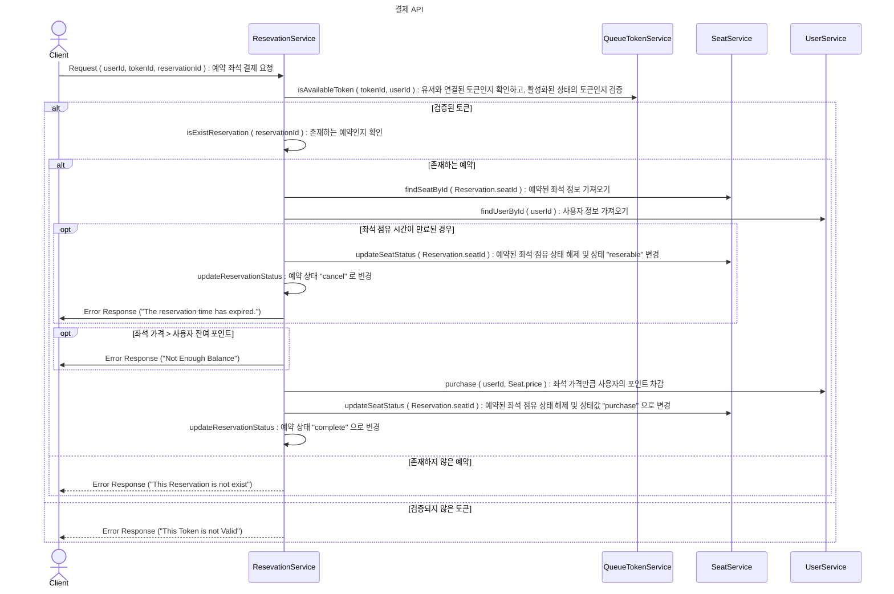

```mermaid
---
title: 결제 API  
---
sequenceDiagram
    Actor cl as Client
    participant re as ResevationService
    participant qu as QueueTokenService
    participant se as SeatService 
    participant us as UserService 

    
    cl->>re : Request ( userId, tokenId, reservationId ) : 예약 좌석 결제 요청 

    
    re->>qu : isAvailableToken ( tokenId, userId ) : 유저와 연결된 토큰인지 확인하고, 활성화된 상태의 토큰인지 검증

    alt 검증된 토큰 
        re->>re : isExistReservation ( reservationId ) : 존재하는 예약인지 확인 
        
        alt 존재하는 예약
            re->> se : findSeatById ( Reservation.seatId ) : 예약된 좌석 정보 가져오기
            re->> us : findUserById ( userId ) : 사용자 정보 가져오기 

            opt 좌석 점유 시간이 만료된 경우 
                re->> se : updateSeatStatus ( Reservation.seatId ) : 예약된 좌석 점유 상태 해제 및  상태 "reserable" 변경 
                re->> re : updateReservationStatus : 예약 상태 "cancel" 로 변경 
                re->>cl  : Error Response ("The reservation time has expired.")
            end 

            opt 좌석 가격 > 사용자 잔여 포인트 
                re->>cl : Error Response ("Not Enough Balance")
            end

            re->> us : purchase ( userId, Seat.price ) : 좌석 가격만큼 사용자의 포인트 차감 
            re->> se : updateSeatStatus ( Reservation.seatId ) : 예약된 좌석 점유 상태 해제 및 상태값 "purchase" 으로 변경
            re->> re : updateReservationStatus :  예약 상태 "complete" 으로 변경  


        else 존재하지 않은 예약 
            re-->>cl : Error Response ("This Reservation is not exist")
        end 
    
    else 검증되지 않은 토큰
        re-->>cl : Error Response ("This Token is not Valid")
    end


                   
```