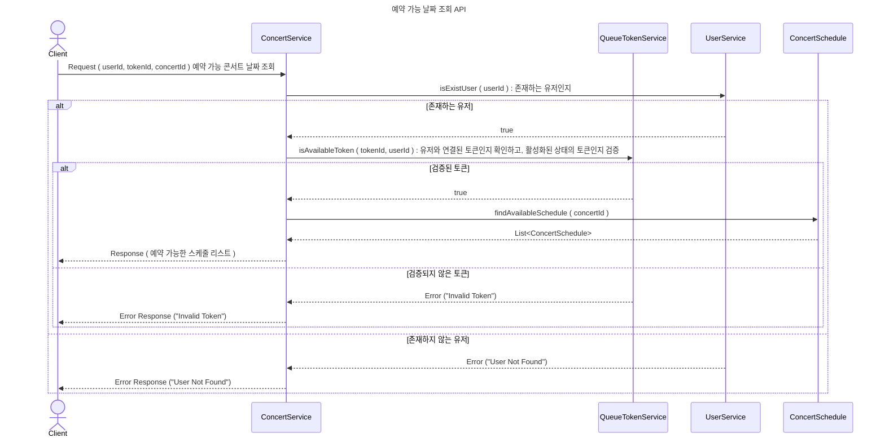

```mermaid
---
title: 예약 가능 날짜 조회 API
---
sequenceDiagram
    actor client as Client
    participant concert as ConcertService
    participant token as QueueTokenService
    participant user as UserService
    participant schedule as ConcertSchedule

    client->>concert: Request ( userId, tokenId, concertId ) 예약 가능 콘서트 날짜 조회
    concert->>user: isExistUser ( userId ) : 존재하는 유저인지
    
    alt 존재하는 유저
        user-->>concert: true
        concert->>token: isAvailableToken ( tokenId, userId ) : 유저와 연결된 토큰인지 확인하고, 활성화된 상태의 토큰인지 검증
        
        alt 검증된 토큰
            token-->>concert: true
            concert->>schedule: findAvailableSchedule ( concertId )
            schedule-->>concert: List<ConcertSchedule>
            concert-->>client: Response ( 예약 가능한 스케줄 리스트 )
        else 검증되지 않은 토큰
            token-->>concert: Error ("Invalid Token")
            concert-->>client: Error Response ("Invalid Token")
        end

    else 존재하지 않는 유저
        user-->>concert: Error ("User Not Found")
        concert-->>client: Error Response ("User Not Found")
    end


```