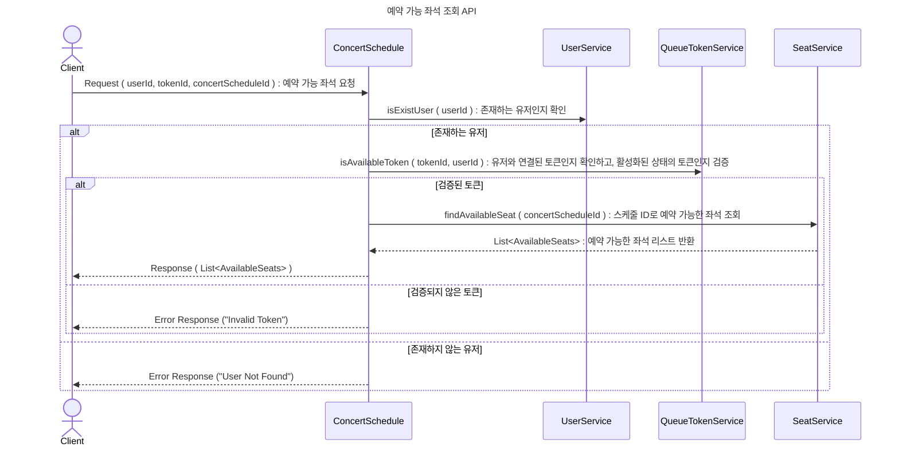

```mermaid
---
title: 예약 가능 좌석 조회 API  
---
sequenceDiagram
    Actor cl as Client
    participant sch as ConcertSchedule
    participant us as UserService
    participant qu as QueueTokenService 
    participant se as SeatService 
    
    cl->>sch : Request ( userId, tokenId, concertScheduleId ) : 예약 가능 좌석 요청 
    sch->>us : isExistUser ( userId ) : 존재하는 유저인지 확인 

    alt 존재하는 유저
        sch->>qu : isAvailableToken ( tokenId, userId ) : 유저와 연결된 토큰인지 확인하고, 활성화된 상태의 토큰인지 검증

        alt 검증된 토큰 
            sch->>se : findAvailableSeat ( concertScheduleId ) : 스케줄 ID로 예약 가능한 좌석 조회
            se-->>sch : List<AvailableSeats> : 예약 가능한 좌석 리스트 반환
            sch-->>cl : Response ( List<AvailableSeats> )

        else 검증되지 않은 토큰 
            sch-->> cl : Error Response ("Invalid Token")
        end 


    else 존재하지 않는 유저 
    
        sch-->>cl :  Error Response ("User Not Found")
    end 
                   
```