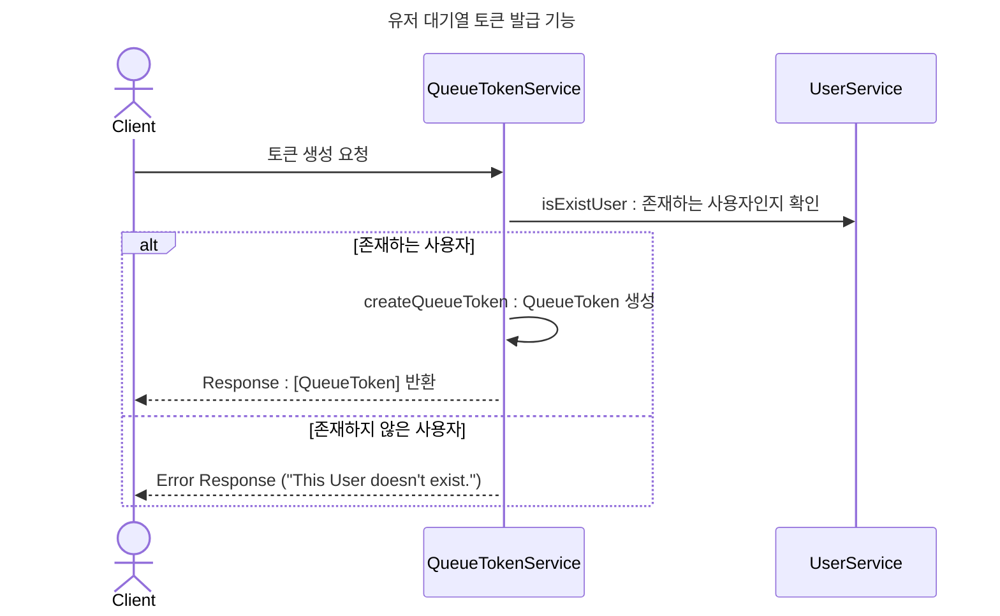

```mermaid
---
title: 유저 대기열 토큰 발급 기능 
---
sequenceDiagram
    actor c as Client
    participant t as QueueTokenService
    participant u as UserService

    c->>t: 토큰 생성 요청   
    activate t
    t->> u  : isExistUser : 존재하는 사용자인지 확인 
    alt 존재하는 사용자 
        t->>t : createQueueToken : QueueToken 생성 
        t-->>c: Response : [QueueToken] 반환 
    else 존재하지 않은 사용자 
        t-->>c: Error Response ("This User doesn't exist.")
    end
```