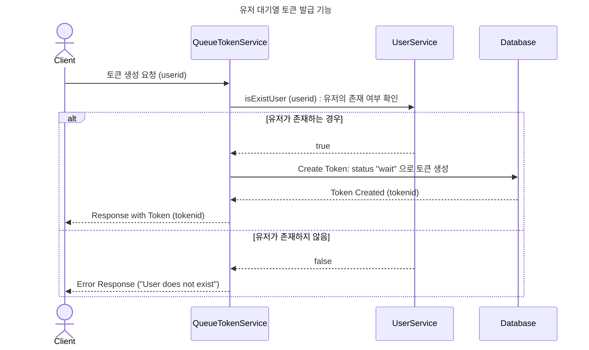

```mermaid
---
title: 유저 대기열 토큰 발급 기능 
---
sequenceDiagram
    actor Client as Client
    participant TokenService as QueueTokenService
    participant user as UserService
    participant Database as Database

    Client->>TokenService: 토큰 생성 요청 (userid)  
    TokenService ->> user  : isExistUser (userid) : 유저의 존재 여부 확인 
    alt 유저가 존재하는 경우
        user -->> TokenService : true
        TokenService->>Database: Create Token: status "wait" 으로 토큰 생성 
        Database-->>TokenService: Token Created (tokenid)
        TokenService-->>Client: Response with Token (tokenid)
    else 유저가 존재하지 않음 
        user -->> TokenService : false
        TokenService-->>Client: Error Response ("User does not exist")
    end


```