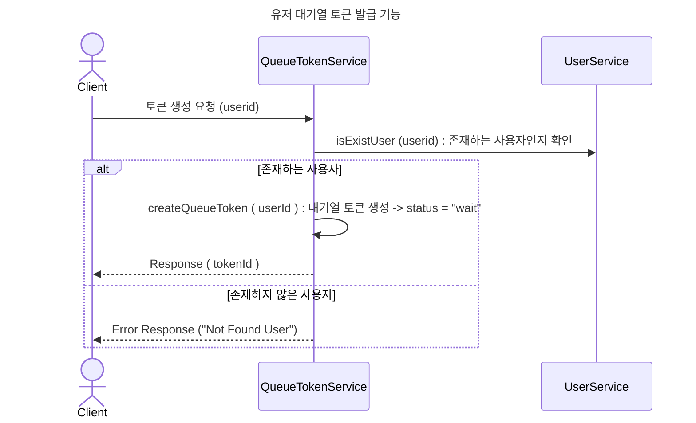

```mermaid
---
title: 유저 대기열 토큰 발급 기능 
---
sequenceDiagram
    actor Client as Client
    participant TokenService as QueueTokenService
    participant user as UserService

    Client->>TokenService: 토큰 생성 요청 (userid)  
    TokenService ->> user  : isExistUser (userid) : 존재하는 사용자인지 확인 
    alt 존재하는 사용자 
        TokenService->>TokenService : createQueueToken ( userId ) : 대기열 토큰 생성 -> status = "wait" 
        TokenService-->>Client: Response ( tokenId )
    else 존재하지 않은 사용자 
        TokenService-->>Client: Error Response ("Not Found User")
    end


```