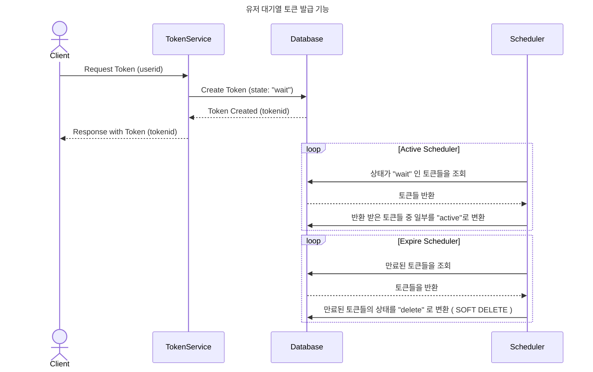

```mermaid
---
title: 유저 대기열 토큰 발급 기능 
---
sequenceDiagram
    actor Client as Client
    participant TokenService as TokenService
    participant Database as Database
    participant Scheduler as Scheduler

    Client->>TokenService: Request Token (userid)  
    TokenService->>Database: Create Token (state: "wait") 
    Database-->>TokenService: Token Created (tokenid)
    TokenService-->>Client: Response with Token (tokenid)

    loop Active Scheduler
        Scheduler->>Database: 상태가 "wait" 인 토큰들을 조회 
        Database-->>Scheduler: 토큰들 반환 
        Scheduler->>Database: 반환 받은 토큰들 중 일부를 "active"로 변환 
    end

    loop Expire Scheduler
        Scheduler->>Database: 만료된 토큰들을 조회
        Database-->>Scheduler: 토큰들을 반환
        Scheduler->>Database: 만료된 토큰들의 상태를 "delete" 로 변환 ( SOFT DELETE )
    end
                
```