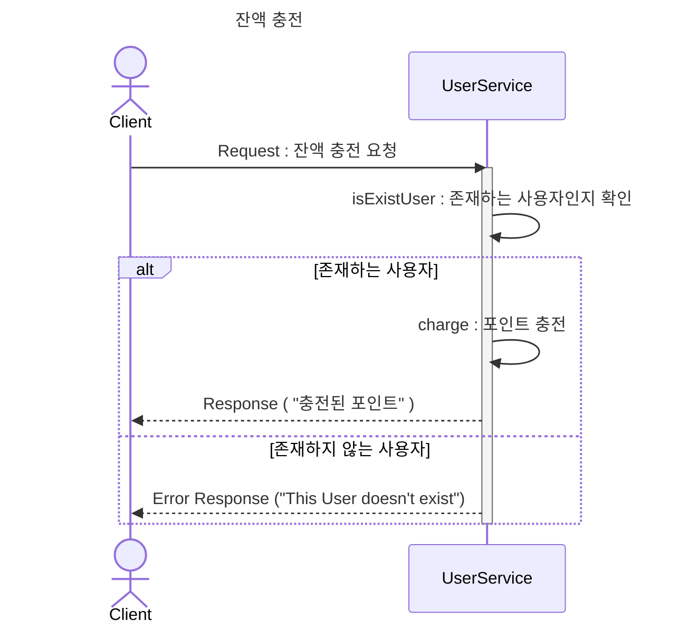

```mermaid
---
title: 잔액 충전 
---
sequenceDiagram
    Actor cl as Client
    participant us as UserService
    
    cl->> us : Request  : 잔액 충전 요청 
    activate us
    us->> us : isExistUser : 존재하는 사용자인지 확인 

    alt 존재하는 사용자
        us->>us : charge : 포인트 충전 
        us-->>cl : Response ( "충전된 포인트" )

    else 존재하지 않는 사용자
        us-->>cl : Error Response ("This User doesn't exist")
    end 

    deactivate us

    
                   
```