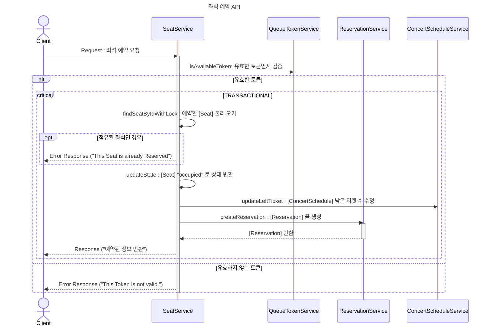

```mermaid
---
title : 좌석 예약 API
---
sequenceDiagram
    Actor c as Client 
    participant se as SeatService
    participant qu as QueueTokenService
    participant re as ReservationService
    participant s  as ConcertScheduleService


    c->> se : Request  : 좌석 예약 요청 
    activate se

    se->>qu : isAvailableToken: 유효한 토큰인지 검증  


    alt 유효한 토큰

        critical TRANSACTIONAL
            se->>se : findSeatByIdWithLock  : 예약할 [Seat] 불러 오기 

            opt 점유된 좌석인 경우 
                se-->>c : Error Response ("This Seat is already Reserved")
            end 

            se->>se : updateState       : [Seat] "occupied" 로 상태 변환
            se->>s  : updateLeftTicket  : [ConcertSchedule] 남은 티켓 수 수정 

            se->>re : createReservation : [Reservation] 을 생성 
            activate re
            
            re-->>se : [Reservation] 반환 
            deactivate re

            se-->> c : Response ("예약된 정보 반환")
        end


    else 유효하지 않는 토큰
        se-->>c : Error Response ("This Token is not valid.")


    end 
    
    deactivate se


```