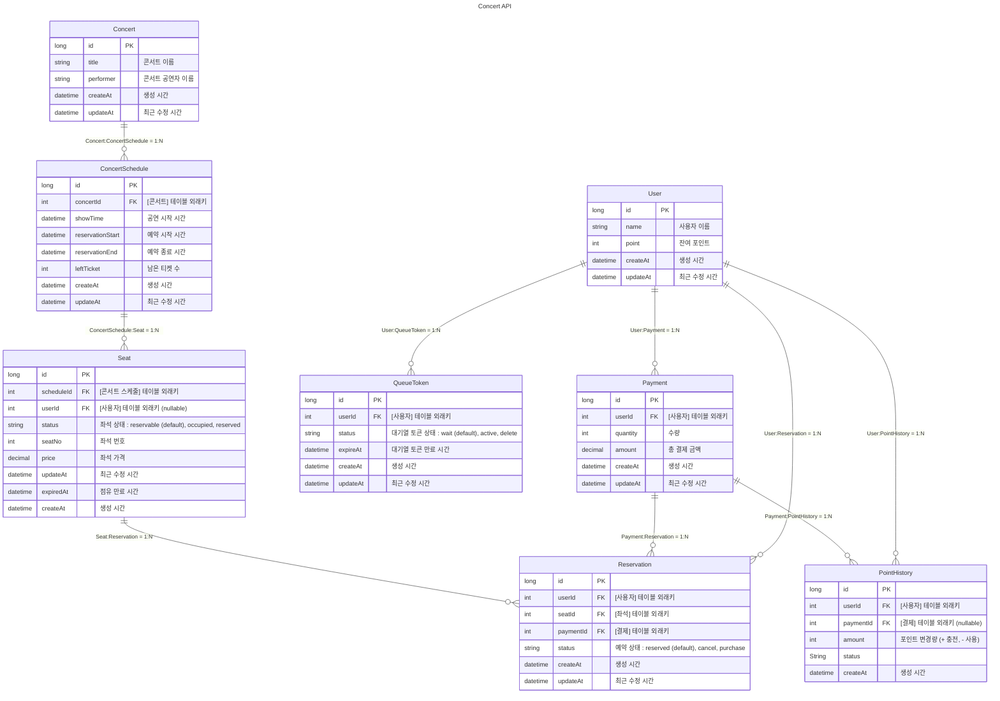

```mermaid
---
title: Concert API
---
erDiagram
    Seat {
        long id PK


        int scheduleId    FK    "[콘서트 스케줄] 테이블 외래키" 
        int userId        FK    "[사용자] 테이블 외래키 (nullable)" 

        string   status           "좌석 상태 : reservable (default), occupied, reserved"
        int      seatNo              "좌석 번호"
        decimal  price           "좌석 가격"
        datetime updateAt       "최근 수정 시간"
        
        datetime expiredAt      "점유 만료 시간"
        datetime createAt       "생성 시간"
        
    }

    Reservation {
        long id PK               
        int userId FK           "[사용자] 테이블 외래키"           
        int seatId FK           "[좌석] 테이블 외래키"
        int paymentId FK        "[결제] 테이블 외래키"

        string status           "예약 상태 : reserved (default), cancel, purchase"

        datetime createAt       "생성 시간"
        datetime updateAt       "최근 수정 시간"
    }

    QueueToken {
        long id PK               
        int userId FK       "[사용자] 테이블 외래키" 
        string status       "대기열 토큰 상태 : wait (default), active, delete"
        datetime expireAt   "대기열 토큰 만료 시간"
        datetime createAt   "생성 시간"
        datetime updateAt   "최근 수정 시간"
    }

    Payment {
        long id PK
        int userId FK       "[사용자] 테이블 외래키"
        int quantity        "수량"
        decimal amount      "총 결제 금액"
        datetime createAt   "생성 시간"
        datetime updateAt   "최근 수정 시간"
    }

    PointHistory {
        long id PK
        int userId FK       "[사용자] 테이블 외래키"
        int paymentId FK    "[결제] 테이블 외래키 (nullable)"
        int amount          "포인트 변경량 (+ 충전, - 사용)"
        String status
        datetime createAt   "생성 시간"
    }

    Concert {
        long id PK   
        string title        "콘서트 이름"
        string performer    "콘서트 공연자 이름"
        datetime createAt   "생성 시간"
        datetime updateAt   "최근 수정 시간"

    }

    ConcertSchedule {
        long id PK
        int concertId FK            "[콘서트] 테이블 외래키"
        datetime showTime           "공연 시작 시간"
        datetime reservationStart   "예약 시작 시간"
        datetime reservationEnd     "예약 종료 시간"
        int leftTicket              "남은 티켓 수"
        datetime createAt           "생성 시간"
        datetime updateAt           "최근 수정 시간"
    }
        User {
        long id PK           
        string name         "사용자 이름"
        int point           "잔여 포인트"
        datetime createAt   "생성 시간"
        datetime updateAt   "최근 수정 시간"
    }

    Seat ||--o{ Reservation : "Seat:Reservation = 1:N"
    Payment ||--o{ Reservation : "Payment:Reservation = 1:N"
    Payment ||--o{ PointHistory : "Payment:PointHistory = 1:N"
    Concert ||--o{ ConcertSchedule : "Concert:ConcertSchedule = 1:N"
    ConcertSchedule ||--o{ Seat : "ConcertSchedule:Seat = 1:N"
    User ||--o{ Reservation : "User:Reservation = 1:N"
    User ||--o{ PointHistory : "User:PointHistory = 1:N"
    User ||--o{ QueueToken  : "User:QueueToken = 1:N"
    User ||--o{ Payment  : "User:Payment = 1:N"

```
