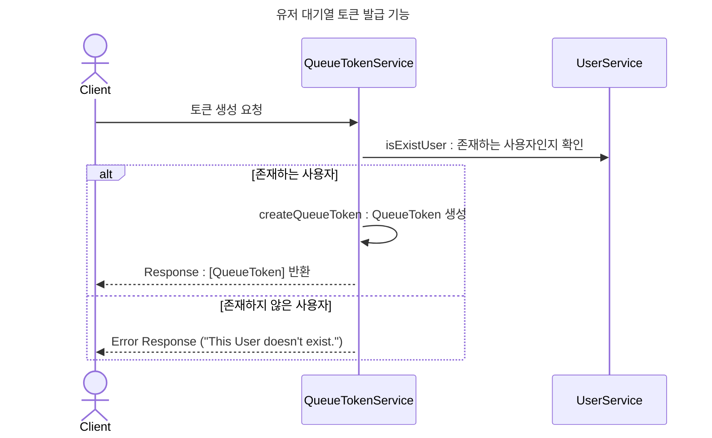
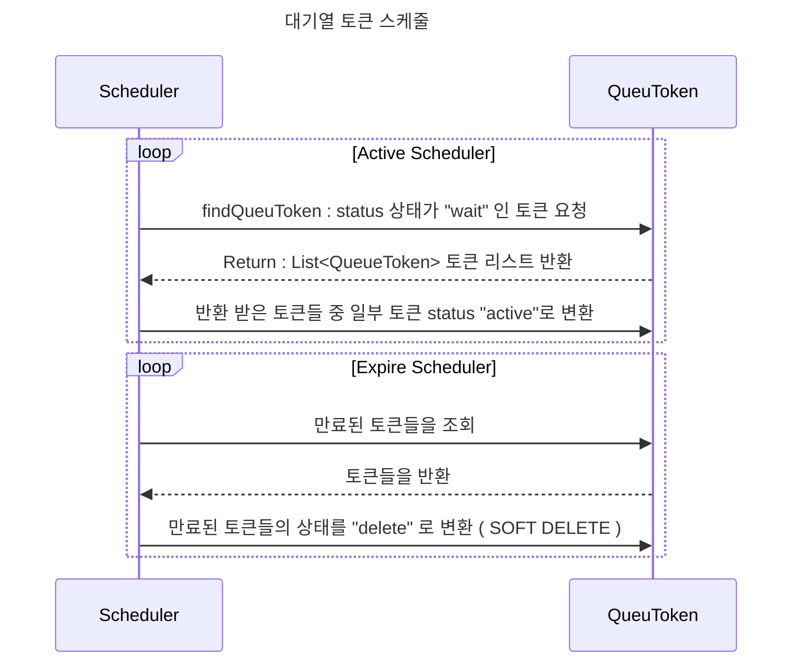
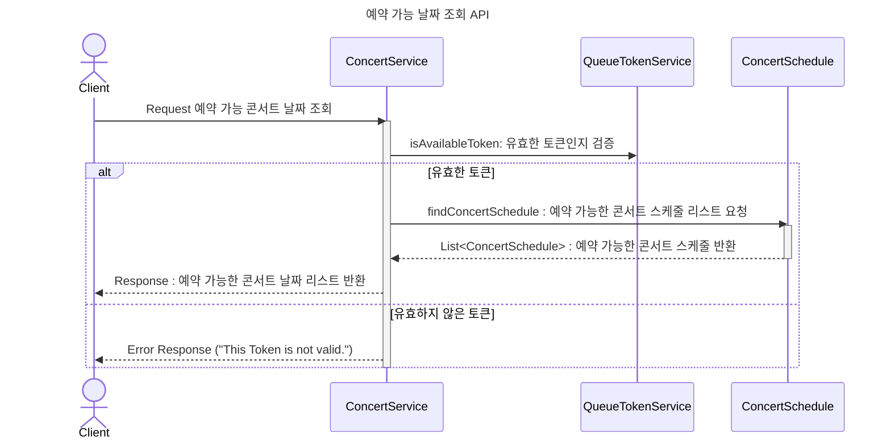
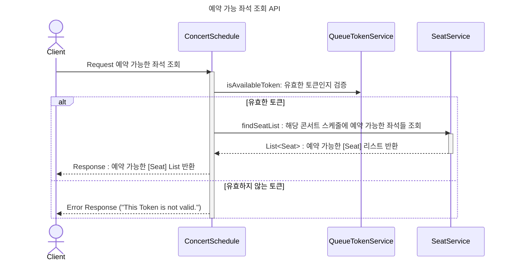
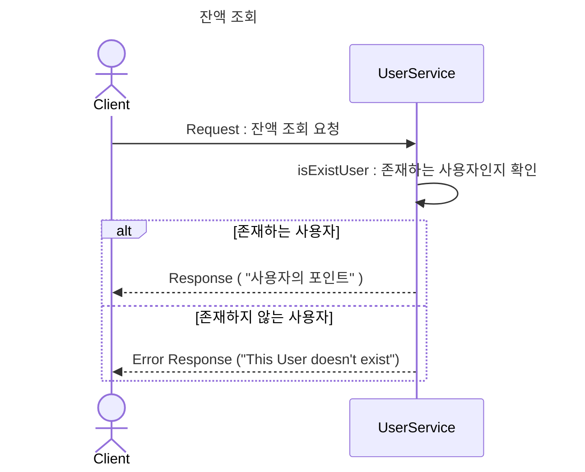
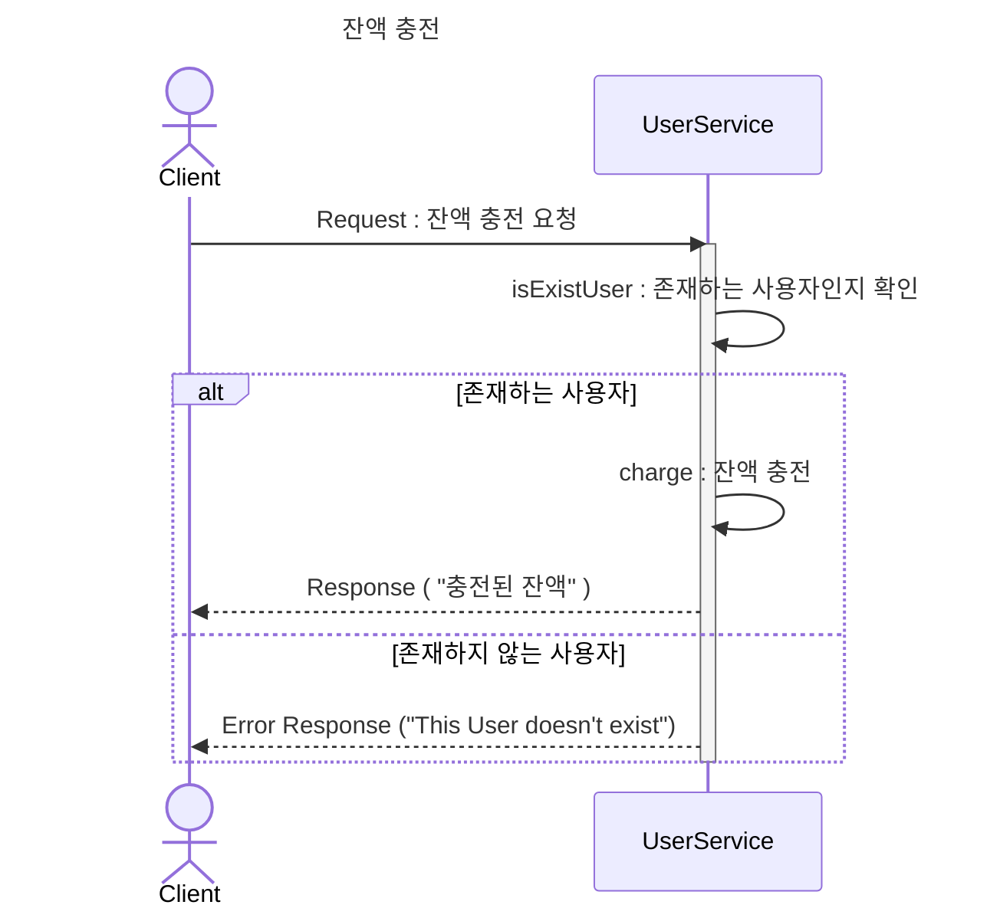
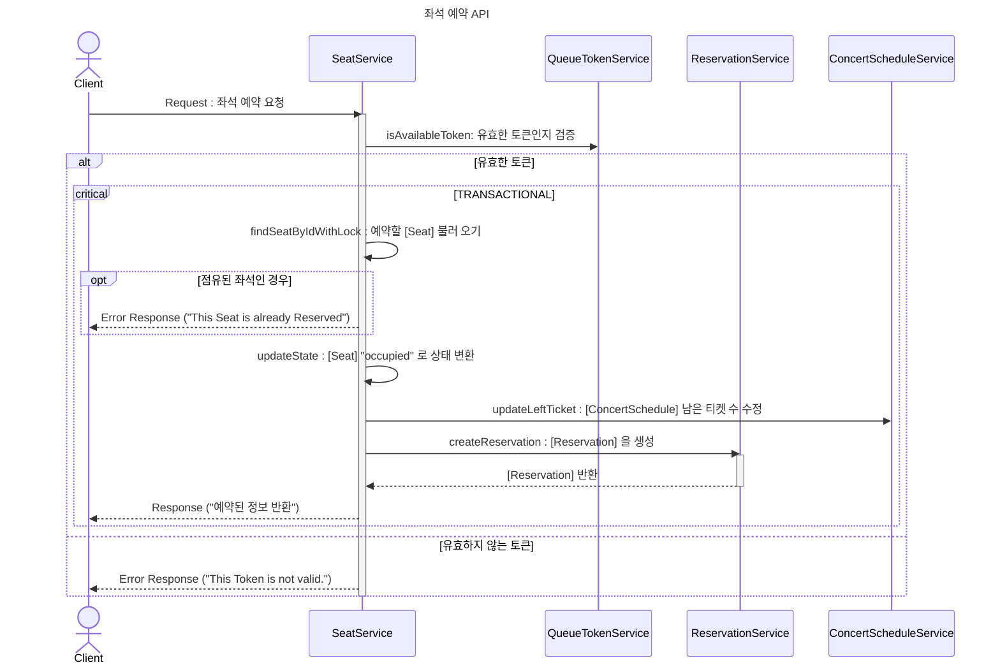
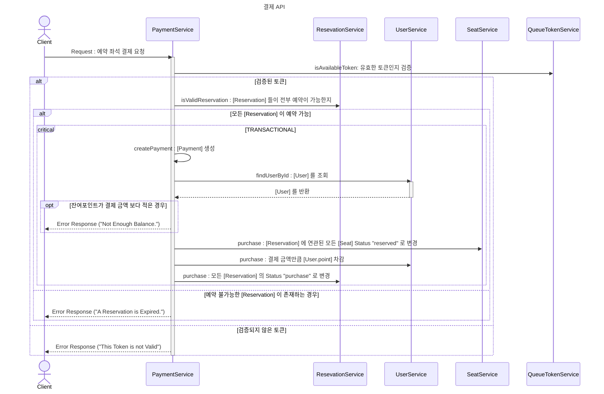

# 콘서트 API 시퀀스 다이어그램
## 1. 유저 대기열 토큰 발급

```mermaid
---
title: 유저 대기열 토큰 발급 기능 
---
sequenceDiagram
    actor c as Client
    participant t as QueueTokenService
    participant u as UserService

    c->>t: 토큰 생성 요청   
    activate t
    t->> u  : isExistUser : 존재하는 사용자인지 확인 
    alt 존재하는 사용자 
        t->>t : createQueueToken : QueueToken 생성 
        t-->>c: Response : [QueueToken] 반환 
    else 존재하지 않은 사용자 
        t-->>c: Error Response ("This User doesn't exist.")
    end
```
---
## 2. 대기열 토큰 스케줄 

```mermaid
---
title: 대기열 토큰 스케줄 
---
sequenceDiagram
    participant s as Scheduler
    participant t as QueuToken
    
    
    loop Active Scheduler
        s->>t : findQueuToken : status 상태가 "wait" 인 토큰 요청
        t-->>s: Return : List<QueueToken> 토큰 리스트 반환  
        s->>t : 반환 받은 토큰들 중 일부 토큰 status "active"로 변환 
    end

    loop Expire Scheduler
        s->>t : 만료된 토큰들을 조회
        t-->>s: 토큰들을 반환
        s->>t : 만료된 토큰들의 상태를 "delete" 로 변환 ( SOFT DELETE )
    end
```

---
## 3. 예약 가능 날짜 조회 

```mermaid
---
title: 예약 가능 날짜 조회 API
---
sequenceDiagram
    actor c as Client
    participant co as ConcertService
    participant q as QueueTokenService
    participant s as ConcertSchedule

    c->>co: Request 예약 가능 콘서트 날짜 조회
    activate co

    co->>q : isAvailableToken: 유효한 토큰인지 검증  

    alt 유효한 토큰
        co->>s : findConcertSchedule : 예약 가능한 콘서트 스케줄 리스트 요청
        activate s 

        s-->>co  : List<ConcertSchedule> : 예약 가능한 콘서트 스케줄 반환 
        deactivate s 

        co-->>c  : Response : 예약 가능한 콘서트 날짜 리스트 반환 


    else 유효하지 않은 토큰 
        co-->>c : Error Response ("This Token is not valid.")
    end 
    
    deactivate co
```

---
## 4. 예약 가능 좌석 조회 

```mermaid
---
title: 예약 가능 좌석 조회 API  
---
sequenceDiagram
    Actor c as Client
    participant cs as ConcertSchedule
    participant q as QueueTokenService 
    participant s as SeatService 
    
    c->>cs : Request 예약 가능한 좌석 조회  
    activate cs

    cs->>q : isAvailableToken: 유효한 토큰인지 검증  

    alt 유효한 토큰
        cs->>s   : findSeatList : 해당 콘서트 스케줄에 예약 가능한 좌석들 조회
        activate s

        s-->> cs : List<Seat> : 예약 가능한 [Seat] 리스트 반환  
        deactivate s

        cs-->> c : Response : 예약 가능한 [Seat] List 반환 

    else 유효하지 않는 토큰
    cs-->>c : Error Response ("This Token is not valid.")

    end

    deactivate cs
```

---
## 5. 잔액 조회 

```mermaid
---
title: 잔액 조회
---
sequenceDiagram
    Actor cl as Client
    participant us as UserService
    
    cl->> us : Request : 잔액 조회 요청
    us->> us : isExistUser : 존재하는 사용자인지 확인 

    alt 존재하는 사용자
        us-->>cl : Response ( "사용자의 포인트" )

    else 존재하지 않는 사용자
        us-->>cl : Error Response ("This User doesn't exist")
    end 
```

---
## 6. 잔액 충전 

```mermaid
---
title: 잔액 충전 
---
sequenceDiagram
    Actor cl as Client
    participant us as UserService
    
    cl->> us : Request  : 잔액 충전 요청 
    activate us
    us->> us : isExistUser : 존재하는 사용자인지 확인 

    alt 존재하는 사용자
        us->>us : charge : 잔액 충전 
        us-->>cl : Response ( "충전된 잔액" )

    else 존재하지 않는 사용자
        us-->>cl : Error Response ("This User doesn't exist")
    end 

    deactivate us
```

---
## 7. 좌석 예약

```mermaid
---
title : 좌석 예약 API
---
sequenceDiagram
    Actor c as Client 
    participant se as SeatService
    participant qu as QueueTokenService
    participant re as ReservationService
    participant s  as ConcertScheduleService


    c->> se : Request  : 좌석 예약 요청 
    activate se

    se->>qu : isAvailableToken: 유효한 토큰인지 검증  


    alt 유효한 토큰

        critical TRANSACTIONAL
            se->>se : findSeatByIdWithLock  : 예약할 [Seat] 불러 오기 

            opt 점유된 좌석인 경우 
                se-->>c : Error Response ("This Seat is already Reserved")
            end 

            se->>se : updateState       : [Seat] "occupied" 로 상태 변환
            se->>s  : updateLeftTicket  : [ConcertSchedule] 남은 티켓 수 수정 

            se->>re : createReservation : [Reservation] 을 생성 
            activate re
            
            re-->>se : [Reservation] 반환 
            deactivate re

            se-->> c : Response ("예약된 정보 반환")
        end


    else 유효하지 않는 토큰
        se-->>c : Error Response ("This Token is not valid.")


    end 
    
    deactivate se
```

## 8. 결제

```mermaid
---
title: 결제 API  
---
sequenceDiagram
    Actor cl as Client
    participant pa as PaymentService
    participant re as ResevationService
    participant us as UserService 
    participant se as SeatService
    participant qu as QueueTokenService


    cl->>pa : Request : 예약 좌석 결제 요청 
    activate pa
    
    pa->>qu : isAvailableToken: 유효한 토큰인지 검증  

    alt 검증된 토큰 
            pa->>re: isValidReservation : [Reservation] 들이 전부 예약이 가능한지 
            
            alt 모든 [Reservation] 이 예약 가능 
                critical TRANSACTIONAL 
                    pa->>pa : createPayment : [Payment] 생성

                    pa->>us  : findUserById : [User] 를 조회
                    activate us 
                    us-->>pa : [User] 를 반환 
                    deactivate us 


                    opt 잔여포인트가 결제 금액 보다 적은 경우 
                        pa-->>cl : Error Response ("Not Enough Balance.")
                    end 

                    pa->>se  : purchase  : [Reservation] 에 연관된 모든 [Seat] Status "reserved" 로 변경 
                    pa->>us  : purchase  : 결제 금액만큼 [User.point] 차감 
                    pa->>re  : purchase  : 모든 [Reservation] 의 Status "purchase" 로 변경
                    


                end 

            else 예약 불가능한 [Reservation] 이 존재하는 경우 
                pa-->>cl: Error Response ("A Reservation is Expired.")
            end

    
    else 검증되지 않은 토큰
        pa-->>cl : Error Response ("This Token is not Valid")
    end

    deactivate pa
```                   
