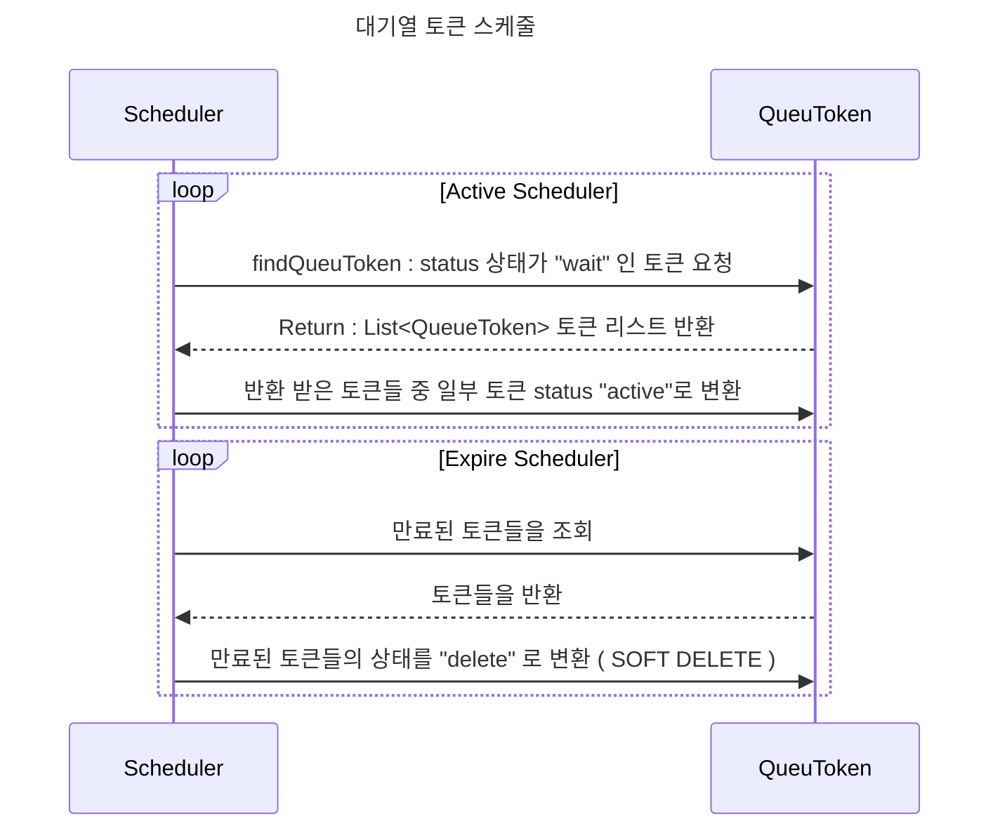

```mermaid
---
title: 대기열 토큰 스케줄 
---
sequenceDiagram
    participant s as Scheduler
    participant t as QueuToken
    
    
    loop Active Scheduler
        s->>t : findQueuToken : status 상태가 "wait" 인 토큰 요청
        t-->>s: Return : List<QueueToken> 토큰 리스트 반환  
        s->>t : 반환 받은 토큰들 중 일부 토큰 status "active"로 변환 
    end

    loop Expire Scheduler
        s->>t : 만료된 토큰들을 조회
        t-->>s: 토큰들을 반환
        s->>t : 만료된 토큰들의 상태를 "delete" 로 변환 ( SOFT DELETE )
    end
                
```