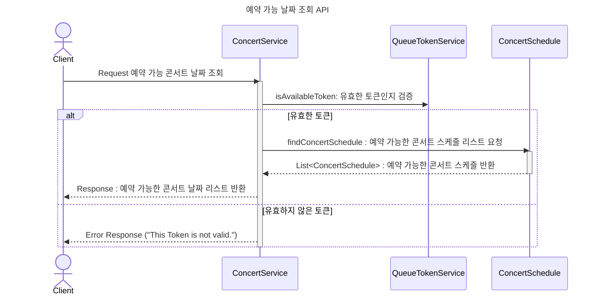

```mermaid
---
title: 예약 가능 날짜 조회 API
---
sequenceDiagram
    actor c as Client
    participant co as ConcertService
    participant q as QueueTokenService
    participant s as ConcertSchedule

    c->>co: Request 예약 가능 콘서트 날짜 조회
    activate co

    co->>q : isAvailableToken: 유효한 토큰인지 검증  

    alt 유효한 토큰
        co->>s : findConcertSchedule : 예약 가능한 콘서트 스케줄 리스트 요청
        activate s 

        s-->>co  : List<ConcertSchedule> : 예약 가능한 콘서트 스케줄 반환 
        deactivate s 

        co-->>c  : Response : 예약 가능한 콘서트 날짜 리스트 반환 


    else 유효하지 않은 토큰 
        co-->>c : Error Response ("This Token is not valid.")
    end 
    
    deactivate co

```