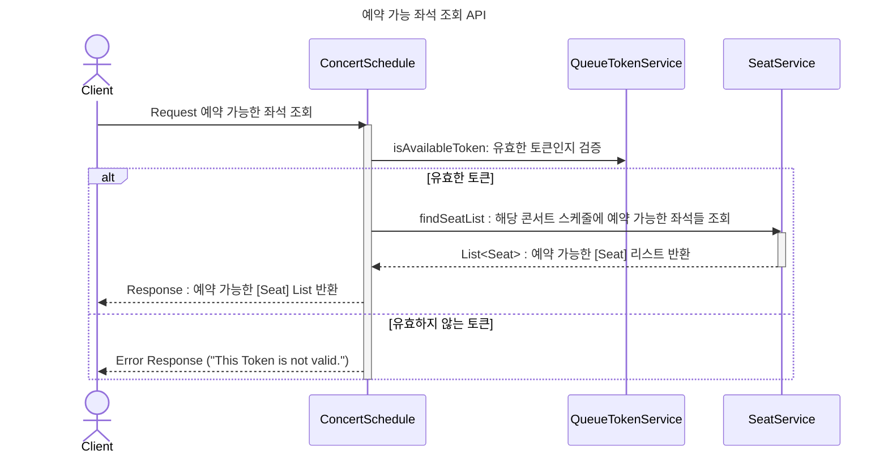

```mermaid
---
title: 예약 가능 좌석 조회 API  
---
sequenceDiagram
    Actor c as Client
    participant cs as ConcertSchedule
    participant q as QueueTokenService 
    participant s as SeatService 
    
    c->>cs : Request 예약 가능한 좌석 조회  
    activate cs

    cs->>q : isAvailableToken: 유효한 토큰인지 검증  

    alt 유효한 토큰
        cs->>s   : findSeatList : 해당 콘서트 스케줄에 예약 가능한 좌석들 조회
        activate s

        s-->> cs : List<Seat> : 예약 가능한 [Seat] 리스트 반환  
        deactivate s

        cs-->> c : Response : 예약 가능한 [Seat] List 반환 

    else 유효하지 않는 토큰
    cs-->>c : Error Response ("This Token is not valid.")

    end

    deactivate cs

```